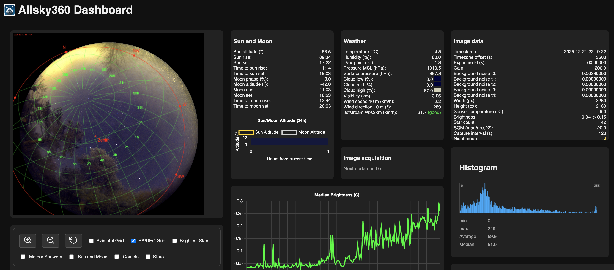
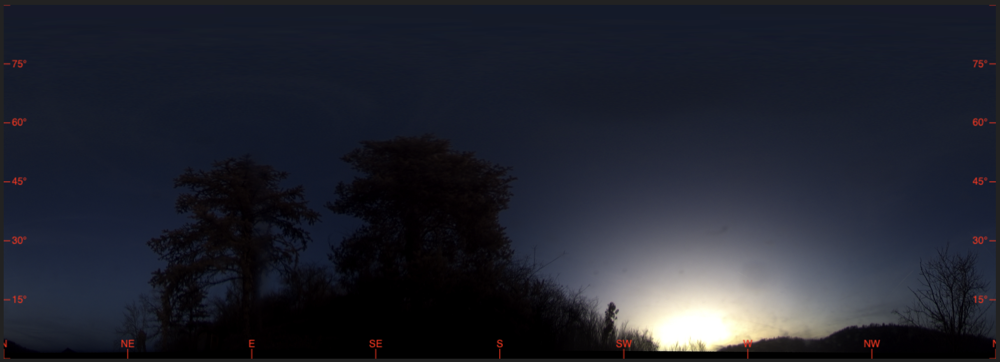

# Allsky360

Allsky360 is an allsky camera system for continuous sky observation. It uses GPU acceleration to process images in real-time, which makes it practical even on smaller embedded systems.

## What it does

The system automatically captures images from your camera and processes them through a pipeline of filters and enhancements. It connects to your camera via [INDIGO](https://github.com/indigo-astronomy/indigo), which is pretty much the standard for astronomy cameras these days.

The GPU acceleration is the key feature here. On a Jetson Orin NX, for example, you can process full-resolution images in seconds instead of minutes. That makes it feasible to run continuously without bogging down the system.

## Features

**Automatic capture**: Once you've set it up, it just keeps taking pictures. No manual intervention needed.

**HDR processing**: You can capture up to 5 different exposures and merge them into a single HDR image. This is really useful when you want to see both bright stars and faint details in the same frame.

**Star detection**: It automatically finds stars in your images. You can use this to overlay star names, or just to see what's visible on any given night.

**Image filters**: There's a whole set of filters built in:

- White balance and color calibration
- Dehaze filter (helps cut through light pollution)
- Clarity and sharpening filters
- Noise reduction (ACDNR works particularly well for astro images)
- Median filtering
- Tone mapping for HDR images

**Panoramas**: You can stitch images into 360° panoramas if needed.

**Metadata**: It automatically adds astronomical data like moon phase and sun position to your images. Handy for keeping track of observing conditions.

**Web API**: There's a REST API so you can access images and data programmatically. I use this to build simple web dashboards.

**Timelapse videos**: The timelapse tool uses GPU acceleration too, so creating videos from hundreds of images doesn't take forever.

## What you need

You'll need an NVIDIA GPU with CUDA support. I've been running this on a Jetson Orin NX, but any CUDA-capable GPU should work fine.

The system runs on Linux (Ubuntu or Debian). You'll also need INDIGO server running – it handles the camera communication. Most modern astronomy cameras work with INDIGO, so compatibility is usually not an issue.

## Getting started

The installation process is documented in [INSTALL.md](INSTALL.md). The main thing is getting [INDIGO](https://github.com/indigo-astronomy/indigo) set up first, then building Allsky360. It's not complicated, but there are a few steps to follow.

## Documentation

- [INSTALL.md](INSTALL.md) – Installation instructions
- [HDR-FUSION.md](HDR-FUSION.md) – How the HDR processing works
- [POSTPROCESSING.md](POSTPROCESSING.md) – Tips for post-processing your images
- [TOOLS.md](TOOLS.md) – Command-line tools and utilities
- [CONTRIBUTING.md](CONTRIBUTING.md) – How to contribute
- [CHANGELOG.md](CHANGELOG.md) – What's changed over time

## License

MIT License. See [LICENSE.md](LICENSE.md) for the details.

## Author

Copyright (c) 2025 Sven Kreiensen
